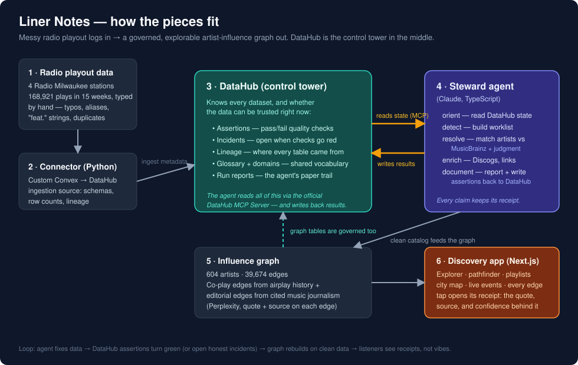

# Liner Notes

**Apache 2.0** · Built for **Build with DataHub: The Agent Hackathon** (Track 1 — Agents That Do Real Work)

Radio Milwaukee's four stations have logged about a million song plays, with
artist names typed by hand: typos, aliases, "feat." strings, duplicates.
Liner Notes turns that messy playout history into an explorable,
DataHub-governed artist-influence knowledge graph — cleaned by an autonomous
steward agent that shows a receipt for every claim it makes.



## The problem

Radio playout systems are where music data goes to rot. DJs type artist names
live, under time pressure, across decades of software migrations. "Erykah Badu",
"Badu, Erykah", and "Erykah Badu feat. Common" are three different strings for
the station's database — so nobody can answer "what have we actually played?"
without a cleanup no one has time to do by hand. Every station, podcast network,
and music library has a version of this table.

## How it works

1. **Connector (Python)** — a custom [Convex](https://convex.dev) ingestion
   source for DataHub: schemas, exact row counts, and lineage for every table,
   recipe-driven like official sources. See [connector/README.md](./connector/README.md).
2. **DataHub** is the control tower. It holds the datasets' schemas and lineage,
   plus the governance surface the agent works against: **assertions** (pass/fail
   quality checks like "resolution coverage ≥ 80%"), **incidents** (opened
   honestly when a check goes red), a **glossary and domains** (shared
   vocabulary), and the agent's **run reports**.
3. **Steward agent (TypeScript + Claude)** — each session narrates five phases:
   *orient* (reads DataHub state through the official
   [DataHub MCP Server](https://docs.datahub.com/docs/features/feature-guides/mcp)),
   *detect* (builds a worklist of unresolved plays), *resolve* (matches artist
   strings against MusicBrainz, with Claude adjudicating the ambiguous ones),
   *enrich* (Discogs profiles, streaming links), and *document* (persists a run
   report and writes assertion results **back** to DataHub). One Convex mutation
   per item, so a killed session resumes without double-applying.
4. **Influence graph** — 604 artists, 39,674 edges from two sources: co-play
   history (which artists share airtime) and editorial edges mined from cited
   music journalism via Perplexity, each carrying its quote, source, and
   confidence.
5. **Discovery app (Next.js)** — search, a force-graph explorer, an
   influence pathfinder, generated playlists, a neighborhood "city map", and
   live-event cards. Tapping any edge opens its receipt: where the claim came
   from and how sure we are.

The loop: the agent fixes data → DataHub's assertions turn green (or open real
incidents when they don't) → the graph rebuilds on clean data → listeners see
receipts, not vibes.

## Try it — judge mode (no private data needed)

Everything below runs on an anonymized sample dataset: real artist names (so
entity resolution genuinely works), synthetic play history across the four real
stations, deliberately messy strings included.

**Prerequisites:** Node 20+, Docker (for the DataHub quickstart), Python
3.9–3.12, [uv](https://docs.astral.sh/uv/), a free [Convex](https://convex.dev)
account, an `ANTHROPIC_API_KEY` (the agent's judgment calls). Optional:
`DISCOGS_TOKEN` (enrichment), `PERPLEXITY_API_KEY` (editorial edges).

```sh
# 1. Install, sign in to Convex, and create your deployment
#    (log in first — the connector step needs a deploy key, and Convex
#     can't mint one for an anonymous local deployment)
npm install
cp .env.example .env.local            # fill in ANTHROPIC_API_KEY at minimum
cd convex && npx convex login && npx convex dev --once && cd ..

# 2. Seed the sample dataset
npm run seed

# 3. DataHub up + ingest your deployment's metadata
cd connector
uv venv --python 3.11 .venv
uv pip install -p .venv/bin/python -e .   # first install downloads ~67MB of wheels
.venv/bin/datahub docker quickstart    # UI at http://localhost:9002 (datahub/datahub)
export CONVEX_URL='<CONVEX_URL from ../convex/.env.local>'
export CONVEX_LINER_NOTES_DEPLOY_KEY="$(cd ../convex && npx convex deployment token create judge | tail -1)"
.venv/bin/datahub ingest -c recipes/convex.judge.yml
cd ..

# 4. Run a steward session (narrated; watch it orient → detect → resolve → document)
#    Writes its assertions/incidents to YOUR quickstart (DATAHUB_GMS_URL
#    defaults to http://localhost:8080).
npm run steward -- --mode=judge

# 5. Build the influence graph from the resolved catalog
npm run graph -- --mode=judge

# 6. Point the web app at your deployment, then explore
grep '^CONVEX_URL' convex/.env.local | sed 's/^CONVEX_URL/NEXT_PUBLIC_CONVEX_URL/' > web/.env.local
npm --workspace web run dev            # http://localhost:3000
```

Optional extras once the above works: `npm run governance` (domains, glossary,
tags, structured properties, incidents in DataHub), `npm run editorial`
(cited editorial edges; needs `PERPLEXITY_API_KEY`), `npm run sync:events`
(live-event matching from the seeded events table).

## Sample outputs (no setup required)

[`docs/samples/`](./docs/samples/) holds real artifacts from production runs
against Radio Milwaukee's data: a steward run report, the full narrated
editorial session log, a generated playlist, and DataHub screenshots
(assertions, lineage, an honest ACTIVE incident). Evidence screenshots from
every milestone live in [`docs/evidence/`](./docs/evidence/).

## Real mode (Radio Milwaukee source data)

Set `CONVEX_SOURCE_URL` and `CONVEX_SOURCE_DEPLOY_KEY` in `.env.local`
(read-only deploy key, scope `deployment:data:view`), then prove the
connection:

```sh
npm run verify:source
# Source deployment reachable. 18 tables: ...
```

## What's here

| Directory | What it is |
|---|---|
| `connector/` | Convex → DataHub ingestion source (Python) — [its README](./connector/README.md) has the recipe format and tests |
| `agent/` | Steward agent + graph builder + editorial/events/governance jobs (TypeScript) |
| `convex/` | Liner Notes deployment: schema, judge-mode seed |
| `web/` | Discovery app (Next.js) |
| `docs/samples/` | Real run artifacts for judges |
| `scripts/` | `verify-source.mjs` — read-only source smoke test |

## Credentials

Every credential the project uses is documented in [.env.example](./.env.example).
Judge mode needs only a free Convex account plus an Anthropic API key.

## License

[Apache 2.0](./LICENSE). The connector is structured for upstream submission
to DataHub — the source registers via the standard
`datahub.ingestion.source.plugins` entry point and runs against a stock
quickstart.
